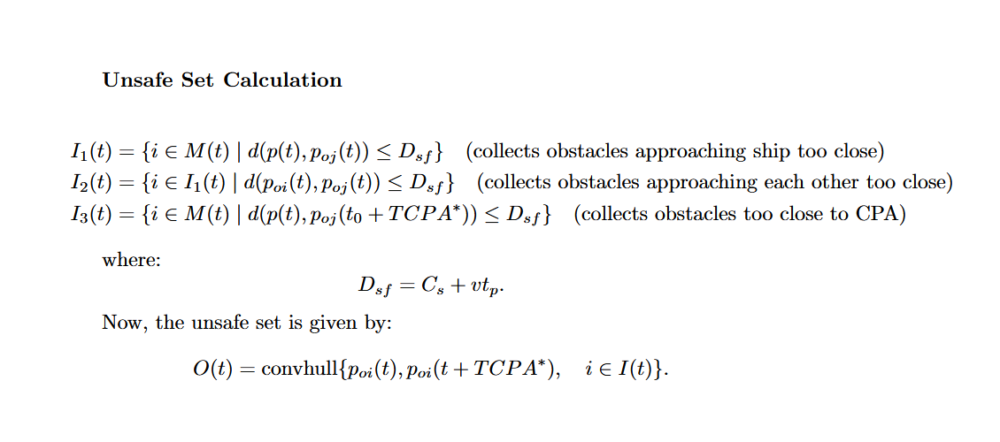

# colav-unsafe-set

[](https://pypi.org/project/colav-unsafe-set)
[](https://pypi.org/project/colav-unsafe-set)
<!--[]-->
This package contains implementation of the custom risk assesment method for motion planners called unsafe set as defined in paper [geometric motion planning in dynamic environments](). 
The following is the high level equation which this package implements.



Show image of geometric unsafe set: 


-----

## Table of Contents

- [Installation](#installation)
- [Structure](#structure)
- [Usage](#usage)
- [License](#license)

## Installation

```bash
pip install colav-unsafe-set
```

risk assessment collision metrics summary

| Case                  | v_rel_norm_sq | p_rel == [0, 0] | tcpa > 0 | DCPA                         | TCPA                      |
|-----------------------|---------------|-----------------|----------|------------------------------|---------------------------|
| 1.1 Identical position | < 1e-6        | ✅              | –        | NaN                          | inf                       |
| 1.2 Stationary, offset | < 1e-6        | ❌              | –        | ‖p_rel‖                     | ‖p_rel‖ / ‖v1‖ (or inf)  |
| 2.1 Future CPA         | ≥ 1e-6        | –               | ✅       | ‖p_rel + tcpa * v_rel‖       | computed tcpa             |
| 2.2 CPA in past        | ≥ 1e-6        | –               | ❌       | NaN                          | NaN                       |


## Structure

## Usage
When pkg is installed, Using it is simple imports are as follows. 

```python
```


## License

`colav-unsafe-set` is distributed under the terms of the [MIT](https://github.com/RyanMcKeeQUB/colav-unsafe-set/tree/main/LICENSE) license.
